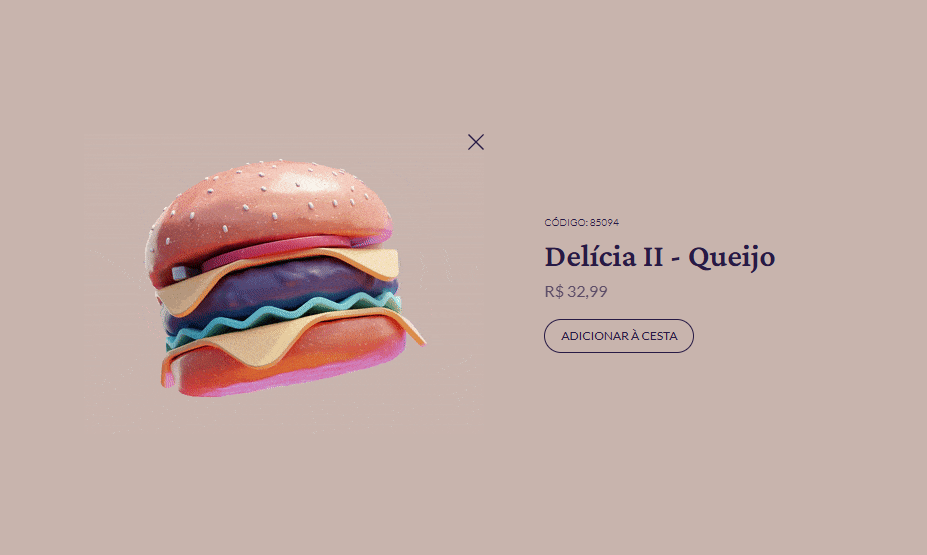

<!-- Projeto Finalizado -->
# 🛒 Cartão de Produto
<p align="center">
  <!-- Contador de linguagens do GitHub -->
  
  <!-- Tamanho do repositório no GitHub -->
  
  <!-- Licença do GitHub -->
  
</p>

<div align="center">
  
</div>

## 🛠️ Tecnologias Utilizadas
- **HTML5**: Estrutura básica da página e elementos.
- **CSS3**: Estilização e animação do cartão de produto.
- **JavaScript**: Alterna entre a imagem estática e a animação do produto.

## 📚 Recursos Adicionais
- [MDN Web Docs - CSS Grid](https://developer.mozilla.org/en-US/docs/Web/CSS/CSS_Grid_Layout)
- [MDN Web Docs - CSS Flexbox](https://developer.mozilla.org/en-US/docs/Web/CSS/CSS_Flexible_Box_Layout)
- [MDN Web Docs - CSS Transitions](https://developer.mozilla.org/en-US/docs/Web/CSS/CSS_Transitions)

## 🔎 Demonstração
Você pode visualizar o projeto online através deste [link](https://devandreotti.github.io/animated-burger/).

## 🚀 Como Rodar o Projeto
1. Clone o Repositório
   ```bash
   git clone https://github.com/devAndreotti/animated-burger.git
   ```
2. Abra o arquivo `index.html` em um navegador da sua escolha.

## 📝 Contribuições
Contribuições são bem-vindas! Siga estas etapas para colaborar:

1. Faça um fork do projeto.
2. Crie uma nova branch para sua feature: `git checkout -b feature/nome-feature`.
3. Commit suas mudanças: `git commit -m 'Adiciona nova feature'`.
4. Envie para a branch: `git push origin feature/nome-feature`.
5. Abra um Pull Request.

## 📌 Nota
Este projeto é para fins educacionais e demonstra a manipulação dinâmica de estilos com CSS e JavaScript. Sinta-se livre para explorar, modificar e adaptar conforme necessário.
